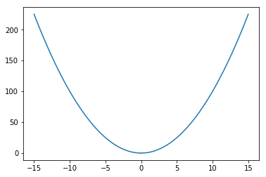
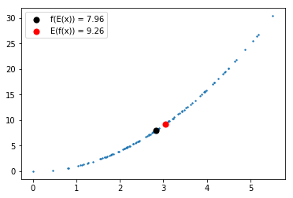
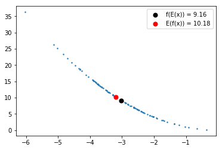
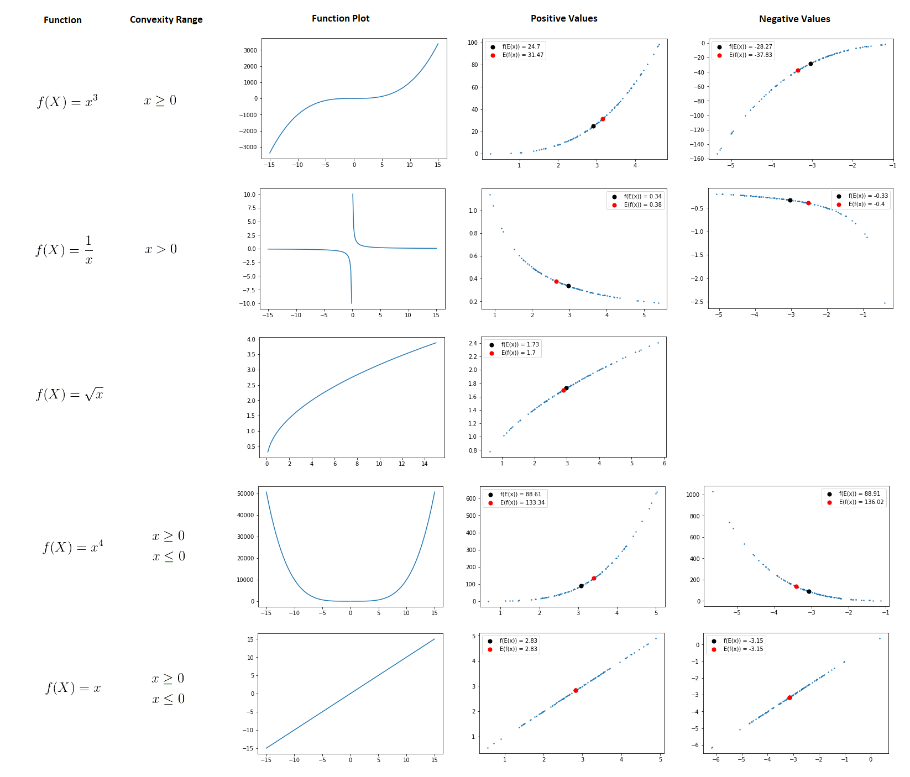

Jensen's Inequality is a condition that always holds for convex functions (and value range of non-strictly convex functions). It is a key point to understand the derivation of the <i>Evidence Lower Bound (ELBO)</i> in Variational Inference of Blei et al. (2016). The goal of this article is to give an intuitive understanding what Jensen's Inequality means. This articles does not recap the mathematical proof of Jensen's Inequality. Jensen's Inequality states the fact that the function outcome of a convex function with the expected value of a random variable <i>X</i> as input is always equal or smaller than the expected value of the convex function outcome.

<p align="center">
<a href="https://www.codecogs.com/eqnedit.php?latex=\dpi{120}&space;f(E(X))&space;\leq&space;E(f(X))" target="_blank"></a>
</p>

This statement is very abstract and it is not trivial to understand. Therefore, let's look at an example. We assume that the random variable <i>X</i> is randomly drawn from a normal distribution with &mu; = 3 and &sigma; = 1. In our example we draw n = 100 samples.

<p align="center">
<a href="https://www.codecogs.com/eqnedit.php?latex=\dpi{120}&space;X&space;\sim&space;N(3,1)" target="_blank"></a>
</p>

```python
import numpy as np
import pylab
```

```python
mean = 3
std = 1
n = 100
```

Next step is to define a function and its reverse function. In our example we choose the following strictly convex function:

<p align="center">
<a href="https://www.codecogs.com/eqnedit.php?latex=\dpi{120}&space;f(X)&space;=&space;x^2" target="_blank"></a>
</p>

```python
def f(x):
    return x**2

def f_reverse(y):
    return y**(1/2)
```

Let's draw the function for the positive and negative value range:

```python
x_negative = np.linspace(-15,-0.0,100) # 100 linearly spaced numbers
x_positive = np.linspace(0.0,15,100) # 100 linearly spaced numbers
y_negative = f(x_negative)
y_positive = f(x_positive)

pylab.plot(x_negative,y_negative, color="C0")
pylab.plot(x_positive,y_positive, color="C0")
pylab.show() # show the plot
```
<p align="center">
</img>
</p>

Now we define a function to sample random values from our normal distribution:

```python
def gen_data(mean, std, n):
    x = np.random.normal(mean,std,(n)) # sample 100 values
    y = []

    e_x = np.mean(x) # compute E(x)
    for _x in x:
        y.append(f(_x))
    e_f_x = np.mean(y)  # compute E(f(x))
    return x, y, e_x, e_f_x
 ```
 
Next step is to sample positive values for <i>x</i> and <i>y</i> and draw a plot that shows f(E(x)) and E(f(x)). For example, if <i>x</i> = [1,2] these values are computed as follows:

<a href="https://www.codecogs.com/eqnedit.php?latex=\dpi{120}&space;E(X)&space;=&space;\frac{1&plus;2}{2}=1.5" target="_blank"></a>

<a href="https://www.codecogs.com/eqnedit.php?latex=\dpi{120}&space;f(E(X))&space;=&space;f(1.5)&space;=&space;1.5^2&space;=&space;2.25" target="_blank"></a>

<a href="https://www.codecogs.com/eqnedit.php?latex=\dpi{120}&space;f([1,2])&space;=&space;[1,4]" target="_blank"></a>

<a href="https://www.codecogs.com/eqnedit.php?latex=\dpi{120}&space;&space;E(f(x))&space;=&space;\frac{1&plus;4}{2}&space;=&space;2.5" target="_blank"></a>

 
```python
x, y, e_x, e_f_x = gen_data(mean,std,n) # sample data for positive value range
pylab.scatter(x, y, s=2)
f_e_x_label = pylab.scatter(e_x, f(e_x), s=50, color='black', label='f(E(x)) = ' + str(round(f(e_x),2)))
e_f_x_label = pylab.scatter(f_reverse(e_f_x), e_f_x, s=50, color='red', label='E(f(x)) = ' + str(round(e_f_x,2)))
pylab.legend(handles=[f_e_x_label, e_f_x_label])
pylab.show() # show the plot
```
<p align="center">
</img>
</p>

As you can see in the plot, the red point is above the black point. Therefore, the condition of Jensen's Inequality holds, no matter how often the experiment is repeated:

```python
f(e_x) <= e_f_x
```
```
True
```

We can also plot it for negative values:<br>
<p align="center">
</img>
</p>

```python
f(e_x) <= e_f_x
```
```
True
```

The function in the above plots is convex for positive and negative values. But there are functions in which the convexity is dependend on its value range. Let's plot different functions:
<p align="center">
</img>
</p>
We can see that Jensens's Inequality also holds for different value ranges of non-strictly convex functions. Additionally, Jensen's Inequality does not hold for function ranges that are non-convex (e.g. <i>x^3</i> for <i>x</i> < 0) and functions that are strictly non-convex (e.g. the root of <i>x</i>). I hope you enjoyed reading this article and got an intuitive understanding what is meant by Jensen's Inequality.
